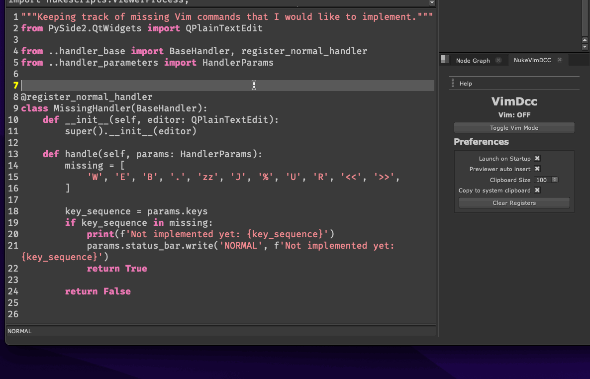

# VimDCC

Vim-like experience for PySide2 applications like Nuke, Maya, Houdini.

- [VimDCC](#vimdcc)
  - [Description](#description)
  - [Features](#features)
  - [Differences from Vim](#differences-from-vim)
  - [Installation](#installation)
    - [Nuke](#nuke)
  - [Settings](#settings)
  - [Known Issues](#known-issues)
  - [Keybindings](#keybindings)
  - [TODO](#todo)
  - [Contributing](#contributing)
  - [Screenshots](#screenshots)

> IMPORTANT: The plugin is still in development and although most of the features are working, there are many bugs and missing features. Feel free to report any issues, feature requests or contribute to the project.

## Description

VimDCC: A Vim-like Event Filter Plugin for PySide2 Applications

VimDCC is a plugin that provides Vim-like functionality to QPlainTextEditor in PySide2 applications such as Nuke, Maya, and Houdini. While it is not a full-fledged Vim implementation, VimDCC offers several useful features, making the QPlainTextEditor a more powerful and efficient editing environment.

VimDCC acts as an event filter installed on a QPlainTextEditor, intercepting keyboard events and allowing users to interact with the text editor using familiar Vim keybindings and commands. This approach ensures that VimDCC can be easily integrated as a drop-in enhancement for the default text editing components in any PySide2 application.

## Features

- Vim like keybindings
- Normal, Insert, Visual, Visual Line modes
- Registers/Clipboard
- Search
- Marks

If you know Vim, you'll feel at home with the plugin. It has most of Vim's basic features, so I won't go into detail. Instead, I'll focus on unique or different features.

## Differences from Vim

**Modes**

The plugin only supports the following modes: Normal, Insert, Visual, Visual Line.

**Registers**

This plugin has two registers (`named` and `clipboard`) that are similar to Vim's implementation. All registers are persistent.

* `named`

  Named registers are like saved text snippets that can be easily pasted later. Named registers include any key on the keyboard except for the `space` key. The `last_search` register is stored in the `/` register.

  Examples:

  * Copy the current line to the `a` register: `"ayy`
  * To paste from the last search register : `"/p`

  > Use `"` to see the list of named registers. Navigate it with arrow keys and select a register with `Enter`. The previewer automatically selects a register when it finds a match, but you can turn off this option in the setting panel by setting `Previewer auto insert` to `False`.

* `clipboard`

  The clipboard register in VimDCC stores a list of the last copied text snippets, acting as a snippet manager. It's a circular buffer with a fixed size, where you can decide how many snippets to keep. When it's full, the oldest snippet is removed. Like the `named` preview panel, you can press `'` to access the clipboard register, displayed in an interactive window, where you can navigate the list with arrow keys and select a snippet by pressing Enter.

## Installation

Download the latest release from the [releases](https://github.com/sisoe24/vimdcc/releases#latest) page. Extract the zip file and copy the `vimdcc` folder to the `~/.nuke` folder.

### Nuke

Supported versions: 13 and above

To install the plugin in Nuke, copy the `vimdcc` folder to the `~/.nuke` folder. Then add the following lines to the `menu.py` file:

```python
from vimdcc import vimdcc
vimdcc.install_nuke()
```
> If you are a NukeTools user, you can use the command `Nuke: Install VimDCC` from the vscode command palette.

Once the plugin is installed, you can find the Nuke Windows -> Custom -> VimDCC menu. From there you can enable/disable the plugin and access the settings panel.

## Settings

The settings are stored in the `.../vimdcc/vimdcc.json` file.

- `Launch on startup` - If `True`, the plugin will be enabled on startup. This settings also influences the Status Bar visibility. If `False`, the Status Bar will be attached to the bottom of the plugin window. If `True`, the Status Bar will be attached to the bottom of the Script Editor window.
- `Previewer auto insert` - If `True`, the previewer will automatically insert the selected register when it finds a match. If `False`, you have to press `Enter` to insert the selected register.
- `Clipboard size` - The number of snippets to keep in the clipboard register.
- `Copy to clipboard` - If `True`, the plugin will copy the selected register to the system clipboard.

## Known Issues

This is a list of the most important issues that I am aware of and not a complete list of all the bugs or of all the missing features.

General:
- Deleting a character with `x`, `X`, `s` does not add the deleted character to the register.
- If you press a key that doesn't correspond to any command, it won't execute anything and will wait for the next key. This can result in a pile-up of invalid keys that will never be resolved. To clear the stack and start fresh, just press the `Esc` key.
- At the moment, the plugin only supports one editor per session. This means that only the first QPlainTextEditor widget will be enabled.
- The `e` motion does not respect the punctuation characters.
- The `a` text object not does work properly with the `w` motion.
- The `VISUAL LINE` mode does not work properly in some cases.
- The `VISUAL` mode does not work properly when combined with search motions.
- `o` and `O` commands do not respect previous indentation.

## Keybindings

A list of all the keybindings that are currently implemented

- `Ctrl+r` - Execute code
- `Alt+r` - Redo
- `\` - Show clipboard panel (backslash)
- `'` - Show named panel (single quote)
- `` ` ``- Show marks panel (backtick)


## TODO

If you are interesed to see a list of what I will like to implemented in the future, or even better, if you want to contribute to the project, check the [TODO.md](TODO.md) file. Feel free to add any feature requests or suggestions.

## Contributing

If you are interested in contributing to the project, please read the [CONTRIBUTING.md](CONTRIBUTING.md) file.


## Screenshots


